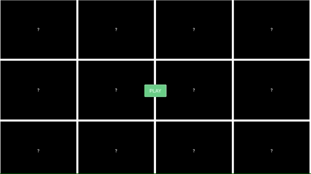

# Memory Game

Hi ! I've just made my first simple game project using React & Redux to practise Algorithmic Thinking in connection with Redux state managment.

Implemented solutions

 1. Cards displayded in grid view
 2. Timer solution for proper time measure
 3. Cards appear only on few seconds
 4. Same two cards clicked one after another will not dissapear - it'ś prefect match
 5. Every pair of card will end the game and stop timer
 
## How it works

## Getting Started

These instructions will get you a copy of the project up and running on your local machine for development and testing purposes. See deployment for notes on how to deploy the project on a live system.

After clone this project the only thing you nedd to do to start this application is installing node modules by typing "npm install" in console and start localhost by typing "npm start" in console.

### How did I create this project ? 

What things you need to install and how to install them

Project was prepared based on CRA template.

npx install create-react-app name --npm

State managment:\
npm install--save react-redux redux

Bulma css framework:\
npm install react-bulma-components

## Deployment

Website was deployed using Netlify

## Authors

* **Mateusz Grzejszczyk** - *Initial work* -

## License
Free licence
